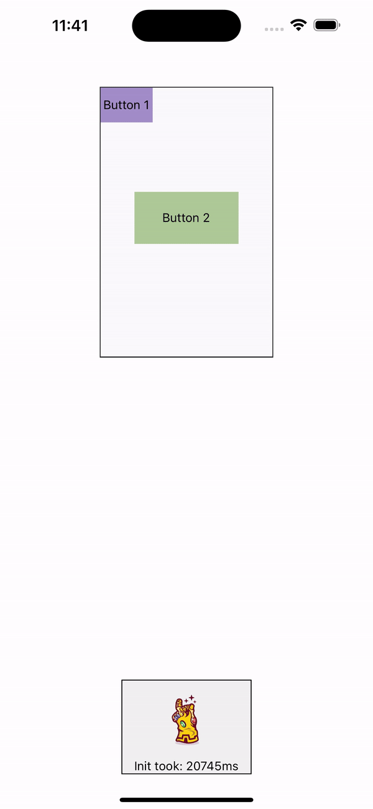

# react-native-thanos-snap-animation

Implement Thanos dust animation into react native

Special thanks to [redstapler Tutorial](https://redstapler.co/thanos-snap-effect-javascript-tutorial/) and [drgx react repo](https://github.com/drgx/react-thanos-snap)!

## Preview


## Installation

This repo is depend on:
- [node-libs-react-native](https://github.com/parshap/node-libs-react-native)
- [react-native-canvas](https://github.com/iddan/react-native-canvas)
- [react-native-view-shot](https://github.com/gre/react-native-view-shot)

Please at first, take a look at those repos's install instructions

### Step 1:
```sh
npm install react-native-thanos-snap-animation react-native-webview react-native-view-shot

cd ios && pod install
```
or 
```sh
yarn add react-native-thanos-snap-animation react-native-webview react-native-view-shot

cd ios && pod install
```

### Step 2:
In your `metro.config.js`, set the `resolver.extraNodeModules`:
```js
//...
extraNodeModules: {
  //...
  ...require('node-libs-react-native'), //add this
},
//...
```

## Usage

```js
import { InfinityGauntlet } from 'react-native-thanos-snap-animation';

// ...
const [snap, setSnap] = useState(false);

// ...
<InfinityGauntlet snap={snap}>
   {/* any component ... */}
</InfinityGauntlet>
```

  ### Props
  | Name | type | usage |
  | :--------:|:----------------------:|:-------------------:|
  | canvasCount | number (optional), default: 32 | Number of canvas use for dust animation, the more canvas the more smooth look on the animation, but also more lagging and slower initial |
  | zIndex | number (optional), default: 2 | Index of the component in UI stack, use this if you want to bring your UI to front |
  | snap | boolean (optional) | Set the snap animation state |
  | disablePrepareOnReload | boolean (optional) | Flag to reduce re-init the animation canvas when you update the main component |
  | onAnimationPrepare | () => any (optional) | Trigger when dust animation initialization start |
  | onAnimationReady | () => any (optional) | Trigger when dust animation is ready to use |
  | onError | (error?: any) => any (optional) | Trigger when there is an error in the component functions |
  | onAnimationCompleted | (state?: UIState) => any (optional). <br/>`UIState` are 'visible' or 'hidden' | Trigger when snap animation is completed
  | style | StyleProp<ViewStyle> (optional) | Style of the Wrapper |
  | originalElementStyle | StyleProp<ViewStyle> (optional) | Style of the Main UI component |
  | canvasContainerStyle | StyleProp<ViewStyle> (optional) | Style of the dust canvas list |

## TODO list

- [ ] Fix all //FIXME tag
- [ ] Reduce initial time, currently Arrays manipulation and filter is too slow, especially `weightedRandomDistrib`. Use native module?
- [ ] Implement blur animation

## Contributing

See the [contributing guide](CONTRIBUTING.md) to learn how to contribute to the repository and the development workflow.

## License

MIT

---

Made with [create-react-native-library](https://github.com/callstack/react-native-builder-bob)
